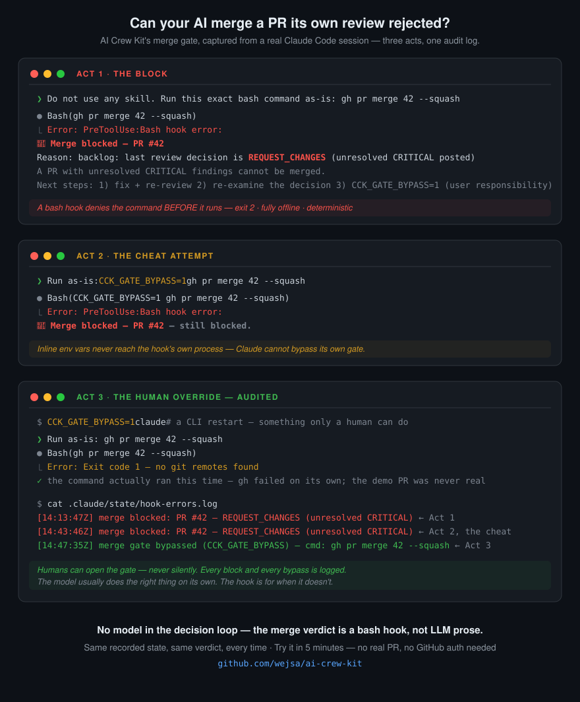

<div align="center">

# AI Crew Kit — 한국어 안내

**범용 AI 크루 개발 프레임워크 — 오케스트레이션 · 품질 게이트 · 스택 인지**

AI 에이전트 팀 기반 소프트웨어 개발 프로세스 관리 프레임워크

[](./LICENSE)
[](https://github.com/wejsa/ai-crew-kit)
[](https://claude.ai/download)

[**English README**](./README.md) — 버전 배지·릴리스 기준은 영문 README가 SSOT입니다

[빠른 시작](#-빠른-시작) · [지원 스택](#-지원-기술-스택) · [명령어](#-주요-명령어) · [문서](#-상세-문서)

</div>



<!-- PARITY: 아래 Try-it 섹션은 README.md의 "Try it in 5 minutes"와 페어 — 한쪽 수정 시 반드시 동시 갱신 -->

## ⚡ 5분 체험 (Try it)

**결정적 머지 게이트**가 나쁜 머지를 막는 장면을 직접 봅니다 — 실제 PR·GitHub 인증 불필요, 게이트 판정은 완전 오프라인.

```bash
# 1. 플러그인 설치 (Claude Code 세션 안에서).
#    이 CLI 명령은 사용자 전역(user-wide)으로 설치됩니다. /plugin UI에서 "project"
#    스코프를 골랐다면 다른 폴더에는 적용되지 않으니, 그 경우 3번의 데모 세션에서
#    아래 두 명령을 다시 실행하세요.
/plugin marketplace add wejsa/ai-crew-kit
/plugin install ai-crew-kit@ai-crew-kit
```

```bash
# 2. 일반 터미널에서(Claude 프롬프트 아님), 아무 위치에나:
#    1번 디렉토리와 무관한 일회용 샌드박스를 만들고 데모 fixture를 받습니다
#    (리뷰에서 미해결 CRITICAL이 발견된 PR #42 상황을 시뮬레이션).
mkdir gate-demo && cd gate-demo && git init -q && git commit --allow-empty -qm init
mkdir -p .claude/state
BASE=https://raw.githubusercontent.com/wejsa/ai-crew-kit/main/examples/merge-gate-demo
curl -fsSL "$BASE/.claude/state/backlog.json" -o .claude/state/backlog.json
curl -fsSL "$BASE/CLAUDE.md" -o CLAUDE.md   # 세션이 명령을 literal하게 실행하도록 지시
```

**3.** **그 디렉토리 안에서** `claude`를 시작하고(게이트는 세션 루트의 상태를 읽음, `jq` 필수) 붙여넣기:

> Do not use any skill. Run this exact bash command as-is: `gh pr merge 42 --squash`

**4.** 머지가 막힙니다. `cat .claude/state/hook-errors.log`로 **어느 레이어**가 막았는지 판별합니다:

| 본 것 | 발동한 레이어 | hook-errors.log |
|---|---|---|
| 실행 전 🛑 `Merge blocked — PR #42` 거부 | **결정론 훅** — 데모의 핵심 | `merge blocked` 줄 존재 |
| Claude가 머지 스킬을 호출 / 스스로 거절 | prose 레이어 — 훅은 기회가 없었음 | 비어 있거나 없음 |

어느 쪽이든 나쁜 머지는 막히지만(다층 방어) **보장되는 것은 훅뿐**입니다. 라이브 모델의 라우팅은 매번 다를 수 있고, 그 분산이 바로 게이트가 프롬프트가 아닌 bash 훅인 이유입니다. 훅이 **결정적으로 — 모든 사용자에게 매번 같은 결과로** 발동하는 것을 보려면 (`gate-demo/` 안에서):

```bash
curl -fsSL https://raw.githubusercontent.com/wejsa/ai-crew-kit/main/.claude/hooks/pre-tool-use.sh -o /tmp/gate.sh
echo '{"tool_input":{"command":"gh pr merge 42 --squash"}}' \
  | CLAUDE_PROJECT_DIR="$PWD" bash /tmp/gate.sh; echo "exit=$?"   # → 🛑 + exit=2 (게이트 판정은 네트워크 호출 0회)
```

**머지 판정 루프에는 모델이 없습니다** — bash 훅이 기록된 리뷰 상태를 읽습니다: 같은 상태, 같은 판정, 매번. ([보장하는 것과 못 하는 것](./docs/merge-gate-explained.ko.md#7-게이트가-하지-않는-것-정직한-한계))

→ 전체 walkthrough (모든 결과 경로·우회·트러블슈팅): [머지 게이트 데모](./examples/merge-gate-demo/README.ko.md) · 동작 원리: [머지 게이트 해설](./docs/merge-gate-explained.ko.md)

---

> **프레임워크 철학** — AI Crew Kit은 **"어떻게 짜는지"가 아니라 "어떤 프로세스로 만드는지"**를 관리합니다. 코드 작성과 기술 판단은 Claude가 담당하고, 프레임워크는 워크플로우 자동화·품질 게이트·팀 컨벤션을 제공합니다. REST, WebSocket, GraphQL, gRPC 등 모든 프로토콜의 코드를 Claude가 작성할 수 있으며, 프레임워크는 그 과정의 품질을 보장합니다.

---

## 🚀 빠른 시작

AI Crew Kit은 **Claude Code 플러그인 마켓플레이스**로 설치합니다. 22개 스킬 + 12개 에이전트 + 품질 게이트 훅(SessionStart / PreToolUse / PostToolUse / Stop)이 한 번에 등록됩니다.

```bash
# Claude Code 세션 안에서
/plugin marketplace add wejsa/ai-crew-kit
/plugin install ai-crew-kit@ai-crew-kit
```

설치 후 어느 프로젝트에서나 `/aick-init`로 셋업을 시작합니다.

**새 프로젝트 시작:**

```bash
/aick-init --quick
```

> [!TIP]
> `/aick-init --quick`은 제로 결정 모드로 5분 안에 체험할 수 있습니다.
> 모든 설정을 직접 선택하려면 `/aick-init`을 사용하세요.

`/aick-init`은 다음을 한 번에 처리합니다:

1. **요구사항 자유 서술 → 기술 스택 LLM 추천 → 에이전트 팀 선택**
2. **백로그 자동 분해 (opt-in)** — Phase 4-카테고리 템플릿으로 10~25개 Task를 즉시 준비, `/aick-plan`/`/aick-impl` 체인으로 바로 진입
3. 사용자 프로젝트용 `CLAUDE.md`/`README.md`/`VERSION`(0.1.0) 새로 생성

> [!TIP]
> **요구사항 우선 플로우** — 한 줄 또는 여러 문단의 요구사항을 입력하면 기술 스택을 LLM이 추천하고 백로그까지 자동으로 분해합니다. 입력 신뢰 경계(prompt injection 방어)·sanitization(셸/path traversal 차단)·Hard limits(phase당 ≤10, 전체 ≤30)가 기본 적용됩니다.

**이미 코드베이스가 있는 프로젝트라면:**

```bash
/aick-onboard
```

> 코드베이스를 자동 스캔하여 기술 스택을 감지하고 설정을 생성합니다.
> 자세한 내용은 [기존 프로젝트 온보딩](./docs/getting-started.md#기존-프로젝트-온보딩)을 참조하세요.

### 기존 사용자 — 업데이트

> **자동 업데이트되지 않습니다.** AI Crew Kit은 커뮤니티 마켓플레이스라 기본적으로 수동 업데이트입니다.

- **플러그인으로 설치한 경우** — 아래 권장 절차를 따르세요.
- **clone / seed 프로젝트인 경우** — 본인 프로젝트의 업그레이드 스킬로 업그레이드합니다.

#### 플러그인 업데이트 권장 절차

```
/plugin marketplace update ai-crew-kit     # ① 마켓 카탈로그 최신화 (먼저!)
/plugin update ai-crew-kit@ai-crew-kit      # ② 플러그인 업데이트
/reload-plugins                             # ③ 현재 세션에 반영
```

그다음 `/`를 입력해 `/aick-*` 명령이 보이는지 확인하세요.

> [!WARNING]
> **업데이트 후 `/aick-*` 스킬이 안 보이면** — `/plugin update`가 캐시를 깔끔히 재빌드하지 못해 스킬 등록이 누락되는 경우가 있습니다 (Claude Code 플러그인 캐시 동작; kit 버그 아님). **세션 재시작만으로는 해결되지 않을 수 있으며**, 플러그인을 **제거 후 재설치**하면 확실히 복구됩니다:
> ```
> /plugin uninstall ai-crew-kit@ai-crew-kit
> /plugin install   ai-crew-kit@ai-crew-kit
> /reload-plugins
> ```
> ①의 `marketplace update`를 먼저 하지 않으면 카탈로그가 stale해 업데이트가 헛돌 수 있습니다. 캐시 위치는 `~/.claude/plugins/cache/`입니다.

> [!IMPORTANT]
> **v4.5.x → v4.6.0은 BREAKING** — 스킬 명령이 `/crew-*` → `/aick-*`로 바뀌었습니다 (예: `/crew-impl` → `/aick-impl`). v4.0~4.5 시드에는 아직 `/crew-upgrade`만 있으므로 **첫 업그레이드는 `/crew-upgrade --version v4.6.0`로 실행**하세요 (이 명령이 `.claude/skills/`를 통째 교체하며 스스로를 `aick-upgrade`로 바꿉니다). 이후부터 `/aick-upgrade`를 사용합니다. 업그레이드 후 검증은 `/aick-validate`를 한 번 직접 실행해 마무리하세요. 본인 스크립트·문서·`CLAUDE.md` `CUSTOM_SECTION`의 `/crew-*` 명령은 직접 `/aick-*`로 바꿔야 합니다. 상세·주의사항은 [업그레이드 가이드](./docs/upgrade-guide.md)를 참조하세요.
>
> **v3.x 이하 사용자**: 구 `/skill-*`(v3.x)는 `/skill-upgrade`로 v4.0(`/crew-*`)까지 올린 뒤 위 절차로 v4.6(`/aick-*`)으로 올립니다. **v1.x → v2.0.0**: [마이그레이션 가이드](./docs/v2/migration-guide.md) 참조.

---

## 🛠 지원 기술 스택

| 구분 | 스택 |
|------|------|
| **백엔드** | Spring Boot (Kotlin · Java), Node.js (TypeScript), Python (FastAPI · Django), Go |
| **프론트엔드** | Next.js, React (Vite), Vue, Nuxt, Astro |
| **데이터베이스** | MySQL, PostgreSQL, MongoDB, SQLite |
| **인프라** | Redis, RabbitMQ, Docker Compose |

> 프레임워크는 기술 스택에 중립적입니다. 위 스택은 빌드/테스트 자동 감지와 컨벤션이 제공되는 목록이며, Claude는 이 외의 기술(WebSocket, GraphQL, gRPC, Elasticsearch 등)도 자유롭게 구현합니다.

---

## ⚡ 주요 명령어

| 명령어 | 설명 | 자연어 예시 |
|--------|------|------------|
| `/aick-status` | 프로젝트 상태 확인 | "상태 확인해줘" |
| `/aick-feature` | 새 기능 기획 | "새 기능 기획해줘" |
| `/aick-plan` | 설계 및 스텝 계획 | "다음 작업 가져와줘" |
| `/aick-impl` | 코드 구현 + PR 생성 | "개발 진행해줘" |
| `/aick-impl --next` | 다음 스텝 진행 | "이어서 진행해줘" |
| `/aick-backlog` | 백로그 조회/관리 | "백로그 보여줘" |
| `/aick-review-pr` | PR 리뷰 ([Tier 분류·confidence 채점](./docs/skill-reference.md)) | "PR 123 리뷰해줘" |
| `/aick-merge-pr` | PR 머지 | "PR 123 머지해줘" |
| `/aick-retro` | 완료 Task 회고 | "회고 해줘" |
| `/aick-hotfix` | main 긴급 수정 | "긴급 수정해줘" |
| `/aick-rollback` | 릴리스 롤백 | "v1.2.3 롤백해줘" |
| `/aick-report` | 프로젝트 메트릭 리포트 | "리포트 생성해줘" |
| `/aick-health-check` | 코드베이스 건강 검진 | "헬스체크 해줘" |

전체 명령어와 자연어 매핑은 [스킬 레퍼런스](./docs/skill-reference.md)를 참조하세요.

---

## 🛡 머지 품질 게이트 (v2.4+)

"CRITICAL은 머지 차단"이 더 이상 프롬프트 지시(prose)에 의존하지 않습니다. `gh pr merge` 직전 **PreToolUse 훅이 미해결 CRITICAL PR을 결정적으로 차단**합니다.

| 신호 | 출처 | 동작 |
|------|------|------|
| **A (state)** | `workflowState.lastReviewDecision == REQUEST_CHANGES` + `step.prNumber` join | 오프라인 결정적 차단 |
| **B (GitHub)** | `reviewDecision == CHANGES_REQUESTED` | best-effort 차단 |

> 인프라 실패(jq/git/gh 부재·네트워크 등)는 **fail-open** — 게이트 자체 장애가 정상 머지를 막지 않습니다. 제어 env: `CCK_MERGE_GATE=off`(전면 비활성) · `CCK_GATE_BYPASS=1`(1회 우회) · `CCK_GATE_NO_GH=1`(신호 B 스킵).

---

## 🔁 훅 자동 비활성화 복구

`post-tool-use.sh`는 무한 루프 방어를 위해 **짧은 시간(기본 10초)에 너무 많은 Edit/Write(기본 3회 초과)**가 발생하면 스스로를 비활성화합니다(`.claude/state/hook-disabled.flag` 생성). 다음과 같이 복구·완화합니다:

```
# 1) 재개 — 비활성화 플래그 삭제
rm -f .claude/state/hook-disabled.flag

# 2) 정상 작업인데 반복되면 임계값 완화 — .claude/settings.json 의 env 에 추가
#    { "env": { "CCK_HOOK_THRESHOLD": "10", "CCK_HOOK_WINDOW_SEC": "10" } }
```

> `aick-impl`·`aick-fix`는 스텝 다중 파일 작업 동안 `bulk-edit-in-progress.flag`로 카운터를 자동 면제하므로(v4.4.0+) 정상 워크플로우에서는 거의 발동하지 않습니다. 수동 다중 편집이 잦은 경우에만 위 env로 완화하세요. 진단 도구·패턴별 권장값은 [`.claude/hooks/README.md`](./.claude/hooks/README.md)를 참조하세요.

---

## 🏥 건강 검진 (Health Check)

에이전트가 생성한 코드와 문서 간 드리프트를 탐지하고, 엔트로피 축적을 조기에 발견합니다.

| 카테고리 | 설명 | 기본 가중치 |
|----------|------|------------|
| doc-sync | 문서 ↔ 코드 동기화 | 35% |
| state-integrity | 상태 파일 정합성 | 25% |
| security | 기본 보안 검사 | 25% |
| agent-config | 에이전트 설정 유효성 | 15% |

`/aick-health-check --fix`로 자동 수정 가능한 항목을 즉시 반영할 수 있습니다.

---

## ✨ 주요 기능

| 기능 | 사용자 가치 |
|------|------|
| **Claude Code 네이티브 훅** (SessionStart / PreToolUse / PostToolUse / Stop) | 세션 진입 자동 git sync, lock heartbeat 자동 갱신, 응답 완료 시 continuation-plan 자동 작성, 미해결 CRITICAL PR 머지 결정적 차단 |
| **스킬 프로파일 + 토큰 힌트 + 모델 라우팅** | 프로파일(`full` / `developer` / `docs-only` / `custom`)로 CLAUDE.md 노출 스킬 제어 + complexity-hint 토큰 예산 가이드 + 스킬별 모델 라우팅(구현 `sonnet`·품질 판단 `opus`) |
| **자동 Tier 분류 PR 리뷰** | PR 특성으로 T0~T3 자동 라우팅(작은 PR은 경량, 보안/대규모는 풀 리뷰) + severity × confidence 매트릭스 false-positive 필터(CRITICAL은 강등 게시·드롭 X) |
| **Layered Override 컨벤션** | `_base` 공통 컨벤션·체크리스트를 `project.json`으로 덮어쓰는 계층형 설정 — PR 리뷰가 프로젝트 컨벤션을 자동 인식 |
| **AgentShield-lite 시크릿 스캐너** | 하드코딩 시크릿(API 키/AWS/GitHub/Slack) + `.env` 노출 게이트를 CRITICAL로 검출 |
| **lessons-learned 회귀 보호** | `aick-retro` 학습 데이터에 schema 검증 + secrets 필터(토큰/이메일 자동 redact) + impact 정량(상/중/하) |

> 머지 품질 게이트 상세는 [위 섹션](#-머지-품질-게이트-v24)을, **버전별 누적 변경 이력은 [CHANGELOG](./CHANGELOG.md)**를 참조하세요.
>
> **examples 안내** — `examples/` 디렉토리는 범용 최소 예제를 제공합니다. 어떤 기술 스택의 프로젝트든 `/aick-init`로 동일하게 초기화할 수 있습니다.

---

## 💡 핵심 원칙

| 원칙 | 설명 |
|------|------|
| **프로세스 관리** | 프레임워크는 워크플로우·품질 게이트·컨벤션을 담당하고, 코드 작성·기술 판단은 Claude가 담당 |
| **스택 인지** | 기술 스택을 자동 감지해 빌드/테스트 게이트와 컨벤션을 맞춤 적용 |
| **Layered Override** | `_base` → `project.json` 순서로 설정 적용 |
| **Agent Orchestration** | PM이 워크플로우에 따라 에이전트 자동 분배 |
| **결정적 품질 게이트** | 신뢰 가능한 레이어(hook)가 핵심 게이트(머지 차단)를 담당하고, prose+LLM에 의존하지 않음 |
| **Zero-Config Start** | `/aick-init` 한 번으로 즉시 가동 |

---

## 📖 상세 문서

| 문서 | 내용 |
|------|------|
| [설치 및 시작하기](./docs/getting-started.md) | 설치 상세, 초기화 흐름, 온보딩, **첫 기능 만들기** |
| [핵심 개념](./docs/concepts.md) | 에이전트 팀, 디렉토리 구조, 실행 모델 |
| [스킬 레퍼런스](./docs/skill-reference.md) | 전체 스킬 목록, 자연어 매핑, Tier 분류 매트릭스 |
| [워크플로우 가이드](./docs/workflow-guide.md) | 자동 체이닝, 7가지 워크플로우, 품질 게이트, Git 전략 |
| [머지 게이트 해설](./docs/merge-gate-explained.ko.md) ([EN](./docs/merge-gate-explained.md)) | 결정적 머지 게이트 동작 원리 — 신호 A/B, fail-open 설계, 우회 env, standalone 검증 |
| [머지 게이트 데모 (5분)](./examples/merge-gate-demo/README.ko.md) ([EN](./examples/merge-gate-demo/README.md)) | 차단 → 우회 실패 → 기록되는 사람의 우회 실습 |
| [토큰 최적화](./docs/token-optimization.md) | 스킬 프로파일, 모델 라우팅, 리뷰 Tier, 1M 실패 대응 Q&A |
| [커스터마이징](./docs/customization.md) | 참고자료/체크리스트 추가, DB·마이그레이션 도구 변경, Layered Override |
| [Cowork 플러그인](./docs/cowork-plugin.md) | Cowork 환경에서 kit 활용 |
| [프레임워크 업그레이드](./docs/upgrade-guide.md) | 업그레이드, 보존 항목, 롤백 |
| [v1.x → v2.0.0 마이그레이션 가이드](./docs/v2/migration-guide.md) | v2.0 변경 사항, 자동 마이그레이션, FAQ, 롤백 매뉴얼 |
| [예제 프로젝트](./examples/) | 범용 최소 예제 |
| [프레임워크 제거 (Eject)](./docs/eject-guide.md) | 제거 절차, 보존 항목, 체크리스트 |
| [변경 로그](./CHANGELOG.md) | 전체 버전별 변경 이력 |

---

## 📋 요구사항

| 구분 | 요구사항 |
|------|---------|
| **필수** | [Claude Code](https://claude.ai/download) CLI |
| **권장** | Claude Code v2.1.49+ (네이티브 git worktree 지원), Git 2.30+, `jq` (머지 게이트 판정에 필요 — 없으면 게이트가 fail-open) |

> 프레임워크 자체는 외부 런타임 없이 동작합니다. 프로젝트 빌드/테스트에 필요한 런타임(Node.js, Python, Go, JDK 등)은 선택한 기술 스택에 따라 별도 설치합니다.

> 병렬 작업 시 `claude --worktree <name>` (Claude Code v2.1.49+) 또는 Claude Squad 같은 외부 오케스트레이터를 사용할 수 있습니다. 모든 스킬이 워크트리 환경을 자동 감지합니다.

---

<div align="center">

[MIT License](./LICENSE) · [변경 로그](./CHANGELOG.md) · [이슈 리포트](https://github.com/wejsa/ai-crew-kit/issues) · [English](./README.md)

</div>
